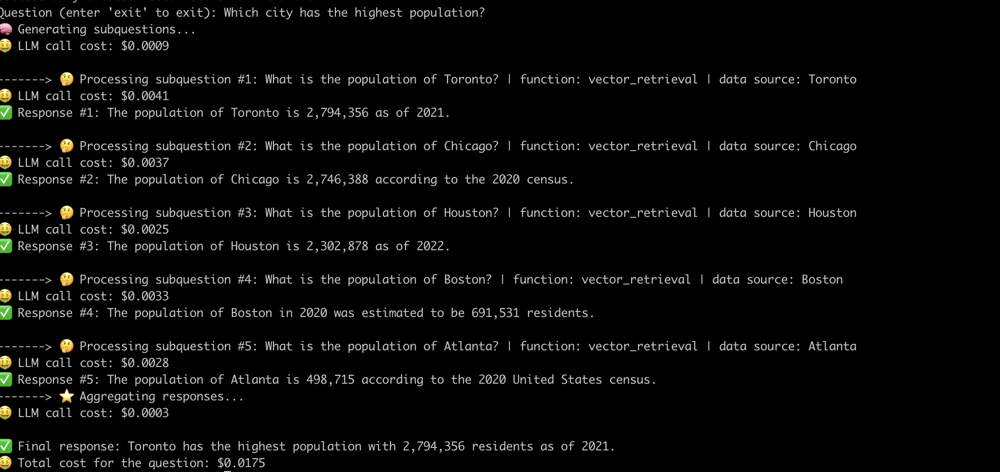
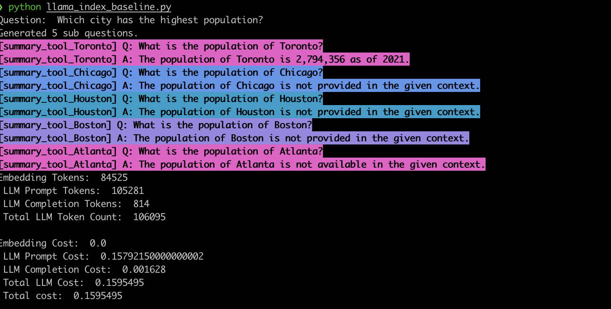

# Demystifying Advanced RAG Pipelines

Retrieval-Augmented Generation (RAG) pipelines powered by large language models (LLMs) are gaining popularity for building end-to-end question answering systems. Frameworks such as [LlamaIndex](https://github.com/run-llama/llama_index) and [Haystack](https://github.com/deepset-ai/haystack) have made significant progress in making RAG pipelines easy to use. While these frameworks provide excellent abstractions for building advanced RAG pipelines, they do so at the cost of transparency. From a user perspective, it's not readily apparent what's going on under the hood, particularly when errors or inconsistencies arise. In this post, we'll shed light on the inner workings of advanced RAG pipelines by examining the mechanics, limitations, and costs that often remain opaque.


## RAG Overview

Retrieval-augmented generation (RAG) is cutting-edge AI paradigm for LLM-based question answering.
A RAG pipeline typically contains:

1. **Data Warehouse** - A collection of data sources (e.g. databases, APIs, etc.) that contain information relevant to the question answering task.

2. **Vector Retrieval** - Given a question, find the top K most similar data chunks to the question. This is done using a vector store (e.g., [Faiss](https://faiss.ai/index.html)).

3. **Response Generation** - Given the top K most similar data chunks, generate a response using a large language model (e.g. GPT-4).

RAG provides two key advantages over traditional LLM-based question answering:
1. **Up-to-date information** - The data warehouse can be updated in real-time, so the information is always up-to-date.

2. **Source tracking** -  RAG provides clear traceability, enabling users to identify the sources of information, which is crucial for accuracy verification and mitigating LLM hallucinations.

## Building advanced RAG Pipelines

<!-- TODO: Add a diagram of a complex RAG pipeline -->
<!-- This section should be about how complex RAG pipelines are in fashion now because of the recent advancements in LLMs and frameworks like LlamaIndex and Haystack. -->

To enable answering more complex questions, recent AI frameworks like LlamaIndex have introduced more advanced abstractions such as the [Sub-question Query Engine](https://gpt-index.readthedocs.io/en/latest/examples/query_engine/sub_question_query_engine.html).

In this post, we'll demystify sophisticated RAG pipelines by building a multi-hop question answering system from the ground up.

**Disclaimer**: We use an off-the-shelf vector index from [EvaDB](https://github.com/georgia-tech-db/evadb) for vector retrieval. However, the concepts are applicable to any vector index.

### The Data Warehouse

The first step in building a RAG pipeline is to create a data warehouse. A data warehouse is a collection of data sources (e.g. databases, APIs, etc.) that contain information relevant to the question answering task.

In this example, we'll use a simple data warehouse containing multiple Wikipedia articles for different popular cities, inspired by LlamaIndex [example use-cases](https://docs.llamaindex.ai/en/stable/examples/index_structs/doc_summary/DocSummary.html). Each Wikipedia article is a separate data source.

Our goal is to build a system that can answer questions like:
1. *"What is the population of Chicago?"*
2. *"Give me a summary of the positive aspects of Atlanta."*
3. *"What is the city with the highest population?"*

As you can see, the questions can be simple retrieval/summarization questions over a single data source (Q1/Q2) or complex retrieval/summarization questions over multiple data sources (Q3).


### Sub-query Generation

The first and the most important step to building a system that can answer all the above questions is generating sub-queries. The task is to break down the user question into a set of sub-queries such that each sub-query is fully answerable by a *single* data source from the data warehouse. Additionally, we need to know which response method to use for each sub-query (i.e. retrieval or summarization).

At first glance, this sub-query generation logic in frameworks like LlamaIndex seems complex. But under the hood, it's powered by a single LLM prompt. We call this the **Sub-query Generation** LLM prompt.

```
-- Sub-query Generation LLM Prompt --

"""
    You are an AI assistant that specializes in breaking down complex inquiries into simpler, manageable sub-questions.
    When presented with a complex user question, your role is to generate a list of sub-questions that, when answered, will comprehensively address the original query.
    You have at your disposal a pre-defined set of functions and data sources to utilize in answering each sub-question.
    If a user question is straightforward, your task is to return the original question, identifying the appropriate function and data source to use for its solution.
    Please remember that you are limited to the provided functions and data sources, and that each sub-question should be a full question that can be answered using a single function and a single data source.
"""
```

To reliably generate the correct format of functions and data sources, we use the powerful [OpenAI function calling](https://openai.com/blog/function-calling-and-other-api-updates) feature paired with Pydantic models. We also use the [Instructor](https://github.com/jxnl/instructor) library to easily generate LLM-ready function schemas.

More details on the full schema definition can be found [here](subquestion_generator.py).

Just using this prompt and the schema, the LLM returns the following output for the above questions:

<table>
<thead>
  <tr>
    <th>Question</th>
    <th>Subquestions</th>
    <th>Retrieval method</th>
    <th>Data Source</th>
  </tr>
</thead>
<tbody>
  <tr>
    <td>"What is the population of Chicago?"</td>
    <td>"What is the population of Chicago?"</td>
    <td>vector retrieval</td>
    <td>Chicago</td>
    </tr>
    <tr>
    <td>"Give me a summary of the positive aspects of Atlanta."</td>
    <td>"Give me a summary of the positive aspects of Atlanta."</td>
    <td>llm retrieval</td>
    <td>Atlanta</td>
    </tr>
    <tr>
    <td rowspan=5>"What is the city with the highest population?"</td>
    <td>"What is the population of Toronto?"</td>
    <td>vector retrieval</td>
    <td>Toronto</td>
    </tr>
    <tr>
    <td>"What is the population of Chicago?"</td>
    <td>vector retrieval</td>
    <td>Chicago</td>
    </tr>
    <tr>
    <td>"What is the population of Houston?"</td>
    <td>vector retrieval</td>
    <td>Houston</td>
    </tr>
    <tr>
    <td>"What is the population of Boston?"</td>
    <td>vector retrieval</td>
    <td>Boston</td>
    </tr>
    <tr>
    <td>"What is the population of Atlanta?"</td>
    <td>vector retrieval</td>
    <td>Atlanta</td>
    </tr>
</tbody>
</table>


<!-- | Question                                                | Subquestions                                                                                                                                                                                        | Retrieval method | Data Source                                        |
|---------------------------------------------------------|-----------------------------------------------------------------------------------------------------------------------------------------------------------------------------------------------------|------------------|----------------------------------------------------|
| "What are the sports teams in Chicago?"                 | "What are the sports teams in Chicago?"                                                                                                                                                             | vector retrieval | Chicago                                            |
| "Give me a summary of the positive aspects of Atlanta." | "Give me a summary of the positive aspects of Atlanta."                                                                                                                                             | llm retrieval    | Atlanta                                            |
| "What is the city with the highest population?"         | "What is the population of Toronto?"<br>"What is the population of Chicago?"<br>"What is the population of Houston?"<br>"What is the population of Boston?"<br>"What is the population of Atlanta?" | vector retrieval<br>vector retrieval<br>vector retrieval<br>vector retrieval<br>vector retrieval | Toronto<br>Chicago<br>Houston<br>Boston<br>Atlanta |
|                                                         |                                                                                                                                                                                                     |                  |                                                    | -->

<!-- Not sure if we need these details - commenting out for now

For example, the function schema to choose vector/summarization retrieval is as simple as:

```python
class FunctionEnum(str, Enum):
    """The function to use to answer the questions.
    Use vector_retrieval for factoid questions.
    Use llm_retrieval for summarization questions.
    """
    VECTOR_RETRIEVAL = "vector_retrieval"
    LLM_RETRIEVAL = "llm_retrieval"
```

The data source schema definition is also straightforward:
```python
class DataSourceEnum(str, Enum):
    """The data source to use to answer the corresponding subquestion"""
    TORONTO = "Toronto"
    CHICAGO = "Chicago"
    HOUSTON = "Houston"
    BOSTON = "Boston"
    ATLANTA = "Atlanta"
```

All of this can be packaged into a simple Pydantic model:

```python
class QuestionBundle(BaseModel):
    question: str = Field(None, description="The subquestion extracted from the user's question")
    function: FunctionEnum
    data_source: DataSourceEnum
```

Using the Instructor library, we can provide the above schema as the desired output format to OpenAI.
```python
from instructor import OpenAISchema

class SubQuestionBundleList(OpenAISchema):
    subquestion_bundle_list: List[QuestionBundle] = Field(None, description="A list of subquestions - each item in the list contains a question, a function, and a data source")

response = openai.ChatCompletion.create(
        model="gpt-3.5-turbo",
        functions=[QuestionBundle.OpenAISchema],
        ...
)
``` -->

### Vector/Summarization Retrieval

Once we have the sub-queries, we can use them to retrieve the relevant information from the data warehouse. Depending on the LLM's response, we use either vector retrieval or summarization retrieval.

For vector retrieval, we use the EvaDB vector index to find the top K most similar data chunks to the sub-query. We then use these data chunks as context for the LLM to generate a concise response.
For summarization retrieval, we directly use the LLM against the data source as context to generate the summary.
This is the heart of the RAG pipeline, and we use the standard **RAGPrompt** from [LangchainHub](https://smith.langchain.com/hub) for this step.

```
-- RAGPrompt --

"""
You are an assistant for question-answering tasks. Use the following pieces of retrieved context to answer the question. If you don't know the answer, just say that you don't know. Use three sentences maximum and keep the answer concise.
Question: {question}
Context: {context}
Answer:
```

### Response Aggregation

This is the final step that aggregates the responses from the sub-queries into a final response. For example, for the question *"What is the city with the highest population?"*, the sub-queries  retrieve the population of each city and then response aggregation finds and returns the city with the highest population.
Unsurprisingly, this is also powered by a single LLM prompt. Even better, the **RAGPrompt** from the previous step works great out-of-the-box for this step as well.


### Putting it all together

After unraveling the layers of abstraction, we uncovered the magical secret ingredient powering the sub-question query engine - just two LLM prompts! One for sub-query generation, the other for retrieval, summarization and aggregation. Here is an example of the full pipeline in action:



## Challenges

Now that we've built a multi-hop question answering system, let's examine some of the challenges associated with such systems.

1. **Prompt sensitivity** - The biggest challenge that we faced while building this system was prompt sensitivity. The LLMs are extremely sensitive to the prompt, and even a small change can result in sub-optimal results. For example, when changing the prompt from *"What is city with the highest population?"* to *"What is the city with the highest number of tech companies?"*, the system fails to generate the correct sub-queries as shown in the table below. Similarly, changing *"Give me a summary of the positive aspects of Atlanta."* to *"Summarize the positive aspects of Atlanta and Toronto."* results in using the wrong retrieval method for the sub-queries.

<table>
<thead>
  <tr>
    <th>Question</th>
    <th>Subquestions</th>
    <th>Retrieval method</th>
    <th>Data Source</th>
  </tr>
</thead>
<tbody>
  <tr>
    <td rowspan=5>"What is the city with the highest number of tech companies?"</td>
    <td>What are the tech companies in each city? ❌ </td>
    <td>vector retrieval</td>
    <td>Toronto</td>
    </tr>
    <tr>
    <td>What are the tech companies in each city? ❌</td>
    <td>vector retrieval</td>
    <td>Chicago</td>
    </tr>
    <tr>
    <td>What are the tech companies in each city? ❌</td>
    <td>vector retrieval</td>
    <td>Houston</td>
    </tr>
    <tr>
    <td>What are the tech companies in each city? ❌</td>
    <td>vector retrieval</td>
    <td>Boston</td>
    </tr>
    <tr>
    <td>What are the tech companies in each city? ❌</td>
    <td>vector retrieval</td>
    <td>Atlanta</td>
    </tr>
    <tr>
    <td rowspan=2>Summarize the positive aspects of Atlanta and Toronto.</td>
    <td>What are the positive aspects of Atlanta?</td>
    <td>vector retrieval ❌</td>
    <td>Atlanta</td>
    </tr>
    <tr>
    <td>What are the positive aspects of Toronto?</td>
    <td>vector retrieval ❌</td>
    <td>Toronto</td>
    </tr>
</tbody>
</table>

<!-- | Question                                                      | Subquestions                                                                                                                                                                                                                            | Retrieval method                                                                                 | Data Source                                        |
|---------------------------------------------------------------|-----------------------------------------------------------------------------------------------------------------------------------------------------------------------------------------------------------------------------------------|--------------------------------------------------------------------------------------------------|----------------------------------------------------|
| "What is the city with the highest number of tech companies?" | What are the tech companies in each city? ❌<br>What are the tech companies in each city? ❌<br>What are the tech companies in each city? ❌<br>What are the tech companies in each city? ❌<br>What are the tech companies in each city? ❌ | vector retrieval<br>vector retrieval<br>vector retrieval<br>vector retrieval<br>vector retrieval | Toronto<br>Chicago<br>Houston<br>Boston<br>Atlanta |
| Summarize the positive aspects of Atlanta and Toronto.        | What are the positive aspects of Atlanta? <br>What are the positive aspects of Toronto?                                                                                                                                                 | vector retrieval ❌<br>vector retrieval ❌                                                         | Atlanta<br>Toronto                                 |
 -->

This behavior is also observed in frameworks like LlamaIndex. In [our implementation](llama_index_baseline.py) of the same example using LlamaIndex Sub-question query engine, the system often generates the wrong sub-queries and also uses the wrong retrieval method for the sub-queries, as shown below.



2. **Cost** - The second challenge is the cost dynamics of advanced RAG pipelines. The issue is two-fold:
    - **Cost sensitivity** - The cost is dependent on the number of sub-queries generated, the retrieval method used, and the number of data sources queried. Since the LLMs are expensive to run, the cost increases with the number of sub-queries and the choice of retrieval method. For example, the incorrect model choice in the LlamaIndex baseline example above (`summary_tool`) results in a 3x higher cost compared to the `vector_tool` while also generating an incorrect response.
    - **Cost transparency** - Advanced abstractions like the Sub-question query engine obfuscate the estimated cost of the query. While frameworks like LlamaIndex provide handy features like the callback manager, they are difficult for a beginner to set up and use.

3. **Context limits** - The final challenge is the context limits of the LLMs. Consider the scenario where the data warehouse contains thousands of data sources. In such cases, the LLM call used by the system will exceed the context limit while describing the available data sources. More sophisticated pipelines and prompt engineering are required to address this issue.

## Conclusion

Advanced RAG pipelines are powerful tools for building end-to-end question answering systems. However, they are not without their challenges. In this post, we demystified the inner workings of advanced RAG pipelines and found that most advanced RAG abstractions boil down to a few LLM prompts. We also identified some of the challenges associated with advanced RAG pipelines such as prompt sensitivity, cost, and context limits. We hope that this post will help you build more robust and cost-effective RAG pipelines.